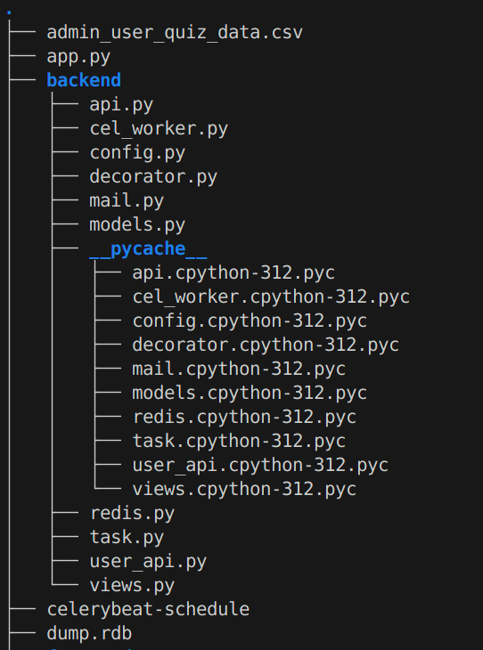
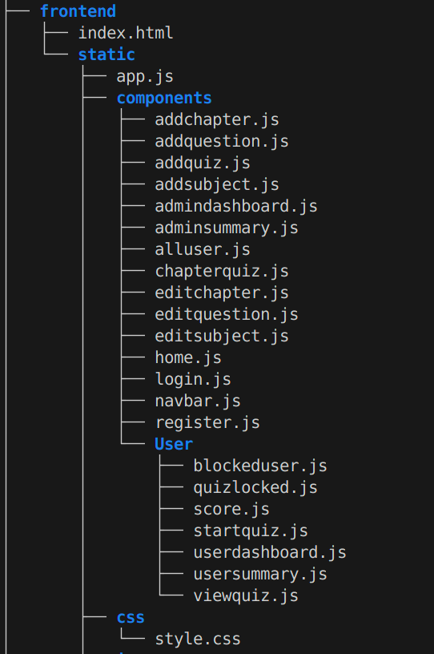
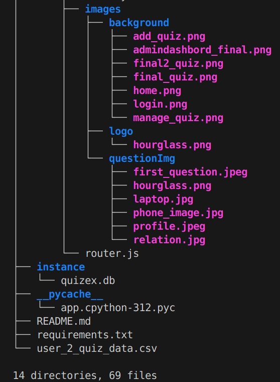

# Quiz master app :- (quizex)
This web app is provide practice for quiz where any one can login and able to attend the quiz and learn new concept of chapter this web app provide practice for each subject chapterwise practice 😘
Commit_doc :- https://docs.google.com/document/u/8/d/e/2PACX-1vT3vAilbkk1HVEY54PfXBg4NxCsHfRjOYuEDS5ololuckz_z3u3E5xxGhFqQkwkLXw3j5TmWbDxRqzx/pub
## To run the Program
follow the simple step


1) if you not have virtual enviroment then make the virtual enviroment
    - **Windows**:  ```   python -m venv env ```
    - **Linux**:    ```   python3 -m venv env ```
    - **mack book**: ```  python3 -m venv env ```
once you make the vitural enviroment now you have to activate the venv for activate use :- ``` source ./venv/bin/activate```
after activating (venv) this word show in starting of terminal 
now
install all package which i include in the requirement.txt "please dont install one by one" for install in one line 
follow the command in any os you are  ``` pip install -r package.txt ```

for deactivating the venv use ``` deactivate or close the terminal ```

- **tip**  :- direct select the python interpretor and in the interpretor select you venv location like ```/venv/pythonversion``` pythonversion can be like 3.12.3 etc

Now select the interperator if you not select the path plese select it so that the error on package in vs code are gone the path is like venv/pythonversion (simple) 😊


1) Run the redis server ``` redis-server ``` and after executing press ctrl+c for kill the redis 
2) Run celery-worker  ``` celery -A app.celery worker --loglevel=info ```
3) Run the app file by using  ``` celery -A app.celery beat --loglevel=info ```
4) Run the app ``` python3 app.py ```
5) Run the mail service ``` MailHog ```
 



